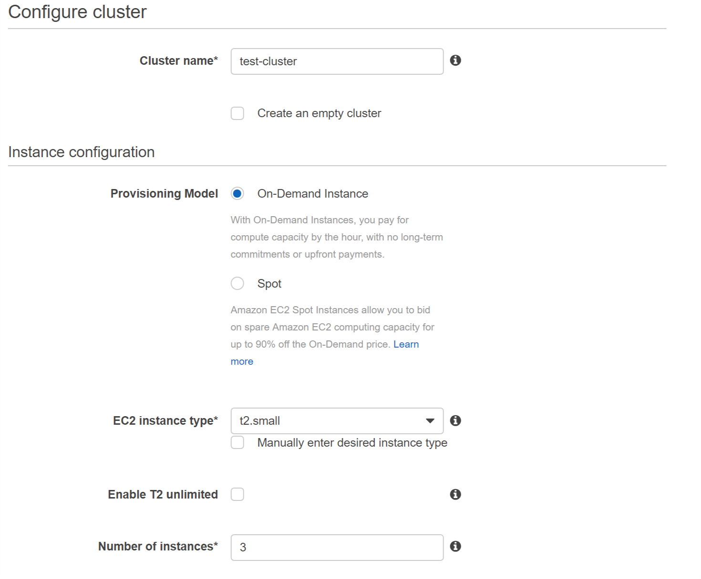
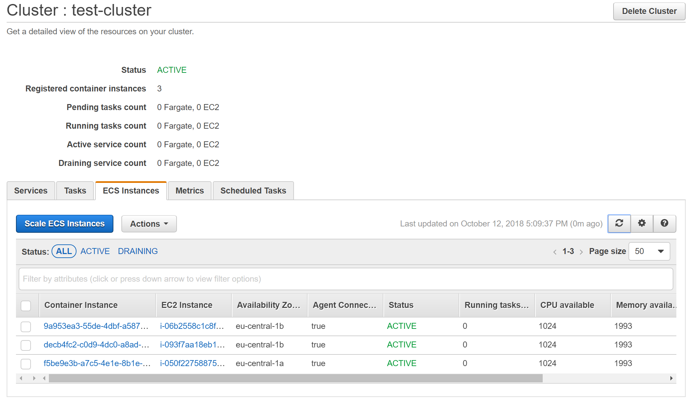
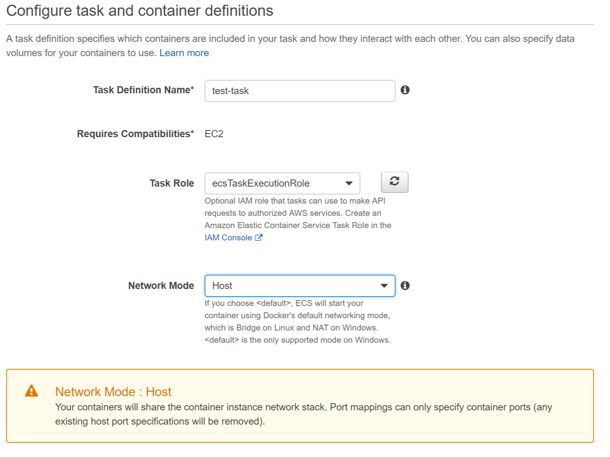
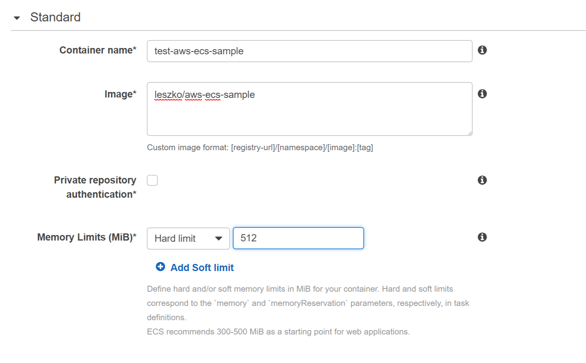
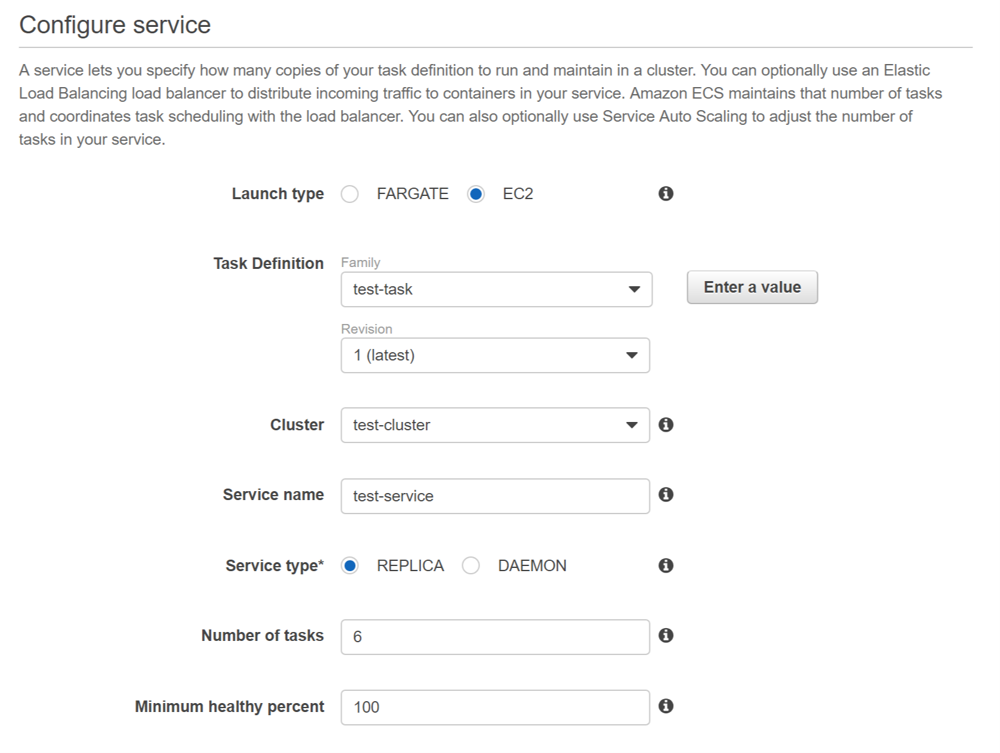
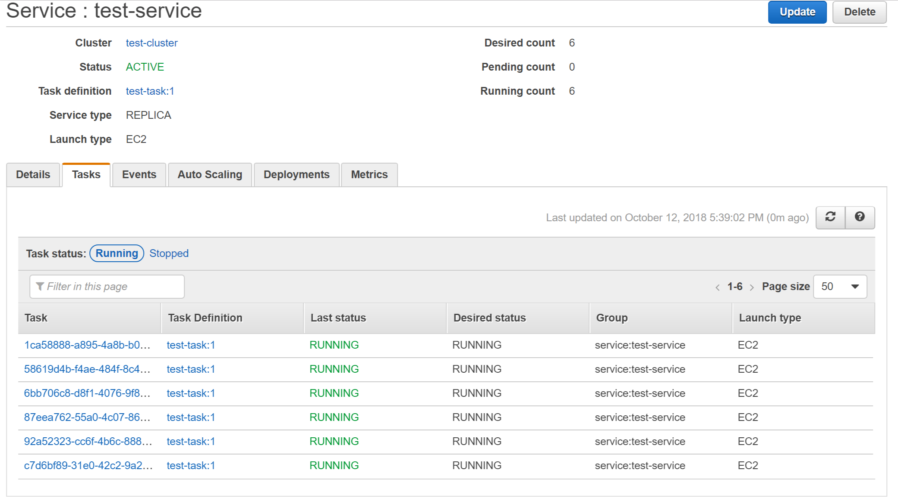
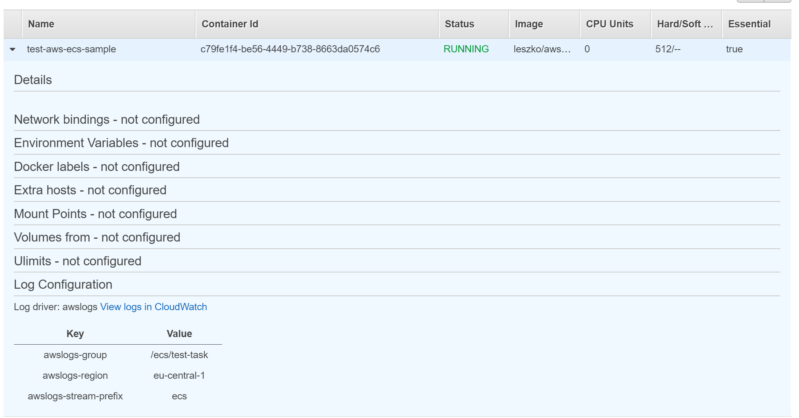

# Hazelcast on Amazon ECS

This is a sample Spring Boot application with embedded Hazelcast, which presents forming a Hazelcast cluster on [Amazon ECS (Elastic Container Service)](https://aws.amazon.com/ecs/).

## 1. Create AWS ECS Cluster

Open AWS ECS Console: [https://console.aws.amazon.com/ecs/home](https://console.aws.amazon.com/ecs/home). Select "Clusters" and "Create Cluster". Choose "EC2 Linux + Networking" and click "Next step".



Note the following fields (you'll need them later for the Hazelcast configuration):
* Cluster name
* VPC CIDR block

You may also want to set "Security group inbound rules" to allow access to your Spring Boot application from outside AWS.


When you click "Create", the cluster is created and after clicking "View Cluster", you should see that the EC2 Instances are assigned to the cluster.



## 2. Configure Hazelcast to work on AWS ECS

You can configure Hazelcast to work on AWS by using the [hazelcast-aws](https://github.com/hazelcast/hazelcast-aws) plugin.

Add the following Maven dependencies:
```xml
<dependency>
    <groupId>com.hazelcast</groupId>
    <artifactId>hazelcast</artifactId>
    <version>3.11</version>
</dependency>
<dependency>
    <groupId>com.hazelcast</groupId>
    <artifactId>hazelcast-aws</artifactId>
    <version>2.3</version>
</dependency>
```

Then, configure the AWS Discovery Strategy properties. You can do it in two different manners: Java-based configuration or XML configuration. In this code sample, we used the first approach:
```java
public Config hazelcastConfig() {
    Config config = new Config();
    config.getNetworkConfig().getInterfaces().setEnabled(true).addInterface("10.0.*.*");
    JoinConfig joinConfig = config.getNetworkConfig().getJoin();
    joinConfig.getMulticastConfig().setEnabled(false);
    joinConfig.getAwsConfig()
              .setEnabled(true)
              .setProperty("region", "eu-central-1")
              .setProperty("tag-key", "aws:cloudformation:stack-name")
              .setProperty("tag-value", "EC2ContainerService-test-cluster");
    return config;
}
``` 

The equivalent XML configuration would look as follows:
```xml
<?xml version="1.0" encoding="UTF-8"?>
<hazelcast xmlns="http://www.hazelcast.com/schema/config" xmlns:xsi="http://www.w3.org/2001/XMLSchema-instance" xsi:schemaLocation="http://www.hazelcast.com/schema/config hazelcast-config-3.11.xsd">
  <network>
    <interfaces enabled="true">
      <interface>10.0.*.*</interface>
    </interfaces>
    <join>
      <multicast enabled="false"/>
      <aws enabled="true">
        <region>eu-central-1</region>
        <tag-key>aws:cloudformation:stack-name</tag-key>
        <tag-value>EC2ContainerService-test-cluster</tag-value>
      </aws>
    </join>
  </network>
</hazelcast>
```

Note the following parameters:
* **interface**: must be the same as "VPC CIDR block"
* **region**: must the same as the region in which your cluster is running
* **tag-key, tag-value**: ECS automatically tags EC2 instances, so you can use the tags (change "test-cluster" to the name of your cluster); if you don't specify "tag-key" and "tag-value", then all your EC2 Instances will be used to form the Hazelcast cluster

## 3. Build application and Docker image

The following command compiles the project, builds the Docker image, and pushes it into your Docker Hub account.

```bash
mvn clean compile jib:build -Dimage=leszko/aws-ecs-sample
```

Please change `leszko` to your Docker Hub login. Then, make sure that your image in Docker Hub is public (you can do it on the [Docker Hub website](https://hub.docker.com/)).

## 4. Create AWS ECS Task Definition

Open again AWS ECS Console and click on "Task Definitions" and "Create new Task Definition". Select "EC2" and click "Next step".



Fill the required fields. Don't forget to set "Network Mode" to "Host" (that is the only network mode currently supported by the Hazelcast AWS Plugin).

Click "Add container", fill the required fields.



Add logging to the container specification.


Click "Add" and "Create" and your task definition is created.

## 5. Start AWS ECS Service

Open your cluster and in the tab "Services", click "Create".



Select your task definition and the number of tasks. Click "Next step" a few times and "Create".

Your service with tasks should be running.



## 6. Verify that Application works correctly

Click on any of the running tasks and scroll down to the "Log Configuration" section.



Click "View logs in CloudWatch". You should see that the Hazelcast Members formed one cluster.


In the real case scenario you would probably set up a load balancer to access your Spring Boot application replicas. Here, if you want to open the Spring Boot application, you need to check its port (in logs) and check the public IP of the given EC2 Instance. Then, open your browser at `http://<public_IP>:<port>/put?key=some-key&value=some-value`.


